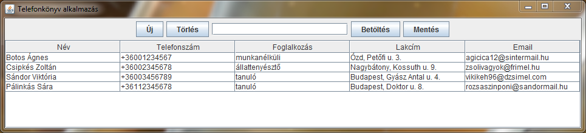

# Telefonkönyv alkalmazás

## Rövid ismertetés
 
 A cél olyan program készítése, amely névjegy-rekordokként tárolja személyek adatait: nevüket, foglalkozásukat és telefonszámukat.
 A program alkalmas új névjegyek létrehozására, a már meglévők törlésére, illetve keresésére, továbbá lehetőség van még az adatbázis fájlba mentésére is.

## Használt osztályok

A ```Main``` classon kívül szükség van egy ```Nevjegy``` osztályra, amely Stringek formájában tárolja el egy-egy személy adatait.
Ezeket a névjegyeket a ```Telefonkonyv``` nevű class fogja össze ArrayList-ként. Ez az osztály valósítja meg mind a keresési, beszúrási, törlési és rendezési algoritmusokat. A ```Nevjegy``` osztály szerializálható.

## Felhasználói környezet

A telefonkönyv megjelenítése a követezőképp történik: a névjegyek egy táblázatban találhatóak meg az összes attribútumukkal együtt.
A megfelelő gombokra való kattintáskor tudjuk elvégezni a kívánt műveleteinket. Új névjegy hozzáadásakor egy új ablak ugrik fel, amely bekéri az adatokat. Törléshez először ki kell választanunk egy névjegyet, majd úgy kattintani a törlés gombra. Az adatbázis lementése és betöltése szintén gombnyomásra történik, mi választhatjuk ki a célmappát. A táblázat oszlopaira kattintva tudjuk a kiválasztott attribútum szerint elvégezni a rendezést. A keresés valós időben zajlik: amint begépeltünk valamit, a kijelölés az első találatra ugrik.


